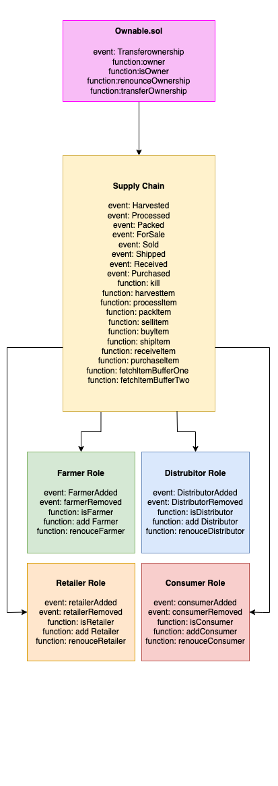

# 3. Supply Chain Dapp

Supply chain that allows its users to interact with the DApp. 
Manage the product life cycle as the product moves through the supply chain.

## UML
### Supplychain

### Sequence

### State

 
### Data Modeling

 
 ## Versions
 Node: v12.13.1 
 Truffle: Truffle v4.1.14 
 Solidity: v0.4.24 
 Metamask: 5.3.1 https://github.com/MetaMask/metamask-extension/releases/download/v5.3.1/metamask-chrome-5.3.1-1.zip
 
 ## Libraries
 truffle-hdwallet-provider: Used for create instance with infura.
 
## Migrate to rinkeby
truffle migrate --reset --compile-all --network rinkeby  
Compiling ./contracts/Migrations.sol... 
Compiling ./contracts/coffeeaccesscontrol/ConsumerRole.sol... 
Compiling ./contracts/coffeeaccesscontrol/DistributorRole.sol... 
Compiling ./contracts/coffeeaccesscontrol/FarmerRole.sol... 
Compiling ./contracts/coffeeaccesscontrol/RetailerRole.sol... 
Compiling ./contracts/coffeeaccesscontrol/Roles.sol... 
Compiling ./contracts/coffeebase/SupplyChain.sol... 
Compiling ./contracts/coffeecore/Ownable.sol... 
Writing artifacts to ./build/contracts 

Using network 'rinkeby'.  

Running migration: 1_initial_migration.js 
  Replacing Migrations... 
  ... 0xd6530fec826ff303433cff3342628ae246a849b02d2bbec23464f66682e18a25 
  Migrations: 0x318b846802ad4fd201a01f85467e197fdbf57316 
Saving successful migration to network... 
  ... 0xae5ddfe8ac9bbc49dad9f2b020a54ecdde24235127417c414097e0ea7df57627 
Saving artifacts... 
Running migration: 2_deploy_contracts.js 
  Replacing FarmerRole... 
  ... 0xc103c227d5f995371387954b4b601b6911c411694575aacd6109854245bf9c37 
  FarmerRole: 0x811fcfe3607a22e5999ed517d62ffa4771699828 
  Replacing DistributorRole... 
  ... 0x9954d0f46070cc525fb323369c1b066fc40850516c1d0eb8c545d08a3daf1ac8 
  DistributorRole: 0x17ad8bda5ee4e93ed93e9224df9a48fb3c43c066 
  Replacing RetailerRole... 
  ... 0x5d21afa73df061a58467da2c6c2116bdb43148df7b22911e2a4b13824d0097dd 
  RetailerRole: 0x6dd5cd82227f0caf22b2bc855f47b836a8d60594 
  Replacing ConsumerRole... 
  ... 0xb564c0b167bbac554833ee68c5c4414d5b172a8e88069ac90443a763542a4526 
  ConsumerRole: 0xdcce63e0c1f96aef3a4a37e9acf2bf7ecc90c4b7 
  Replacing SupplyChain... 
  ... 0xe5d002712490417ccb4e79df2fcb7963d67c027aa69b9d08d7e40cb82952f3ac 
  SupplyChain: 0xbc4bf90265c24097237e8f6e52ce61301bc300e5 
Saving successful migration to network... 
  ... 0x34911e8ec4bca6f83fe278fdbf62ff329939fa0d7fc53316bceab8d72c411ff8 
Saving artifacts...
